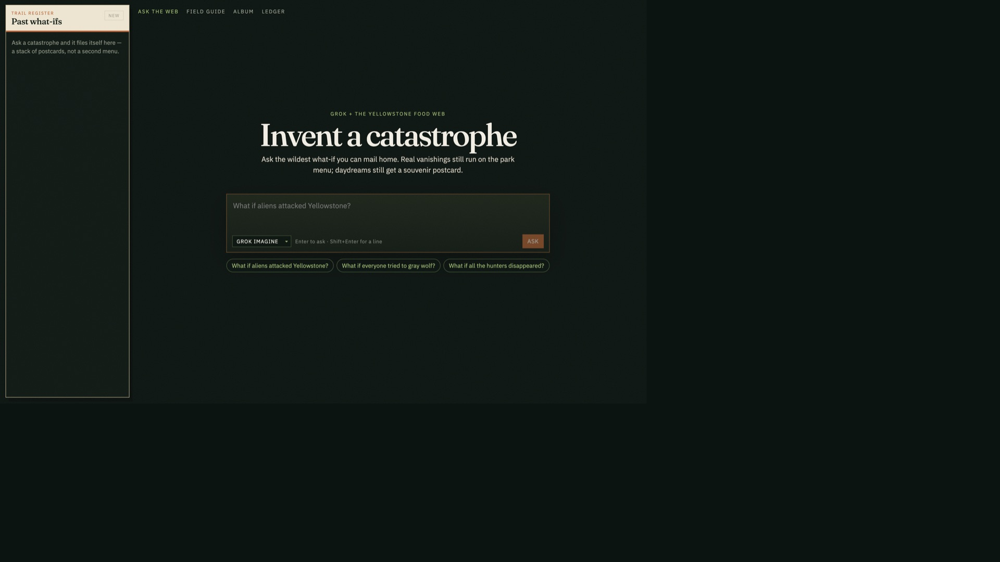
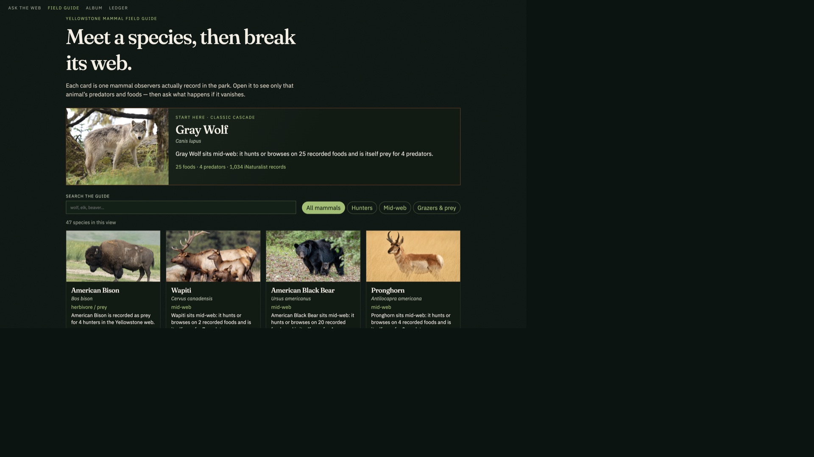
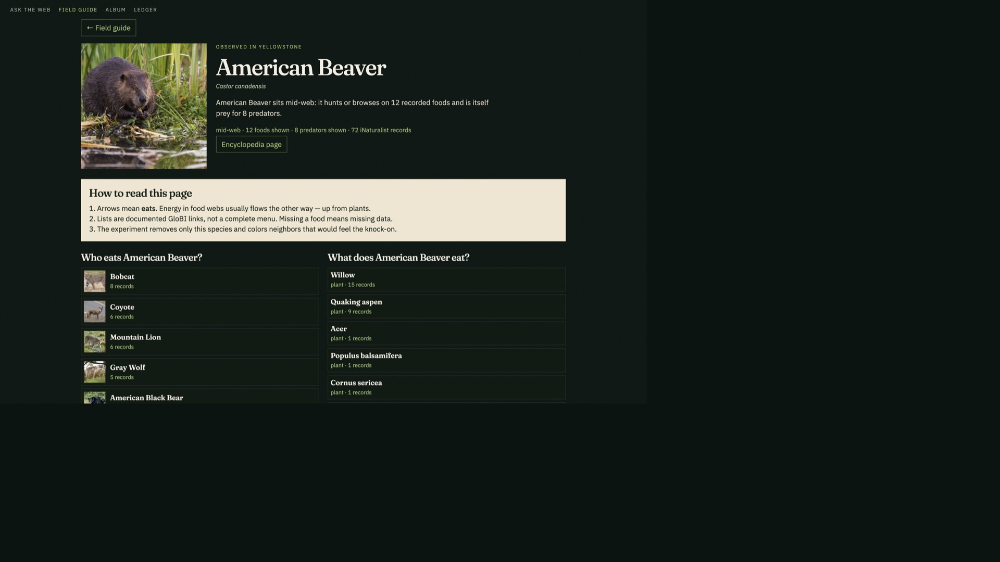
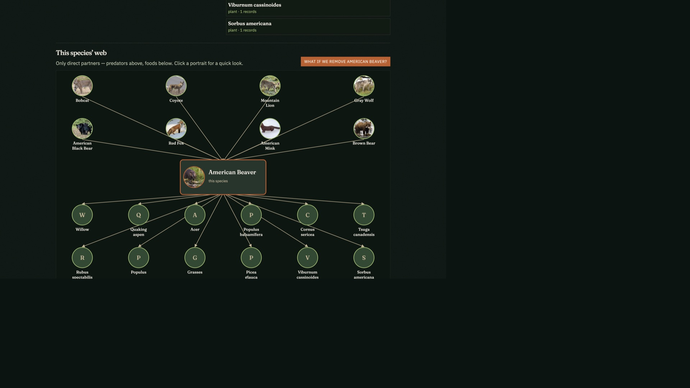
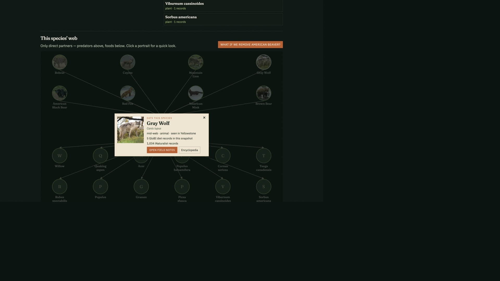

# What if the web breaks?

An educational Yellowstone food-web playground. Ask the park a wild what-if, meet a mammal, remove it, and watch documented knock-ons light up — wolves, elk, willow, the classic cascade — told in plain language. You leave with a souvenir postcard.

**Play it:** [yellowstone-what-ifs.onrender.com](https://yellowstone-what-ifs.onrender.com)











Data is **not** a full Earth dump. The snapshot is:

- [iNaturalist](https://www.inaturalist.org) research-grade mammal species for Yellowstone NP
- [GloBI](https://www.globalbioticinteractions.org) who-eats-whom records among those taxa (plus a few diet plants)
- A handful of well-known park links seeded when GloBI is sparse, labeled in the JSON

Cascades are qualitative graph walks, not population models.

## Run

```bash
python3 -m venv .venv
source .venv/bin/activate
pip install -r requirements.txt

# API
uvicorn api.main:app --reload --port 8000

# UI (second terminal)
cd web && npm install && npm run dev
```

Open http://localhost:5173

Optional Grok narration: copy `.env.example` to `.env` and set `XAI_API_KEY`. Without it, template stories still run. Postcard stills use Grok Imagine by default (`XAI_API_KEY`); Fal Flux is an optional fallback (`FAL_KEY`).

## Refresh the graph

```bash
.venv/bin/python scripts/ingest_globi.py
```

## Tests

```bash
.venv/bin/pytest tests -v
```
